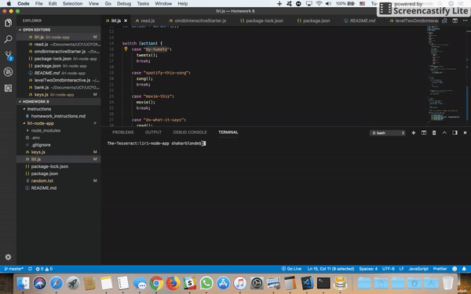
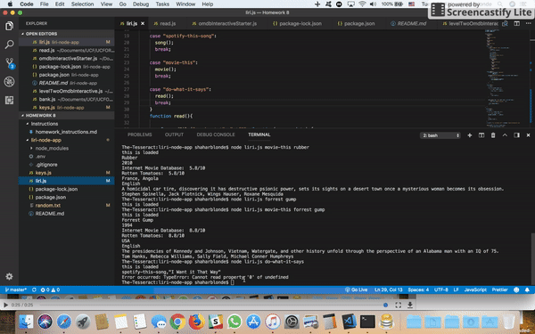

# liri-node-app

Liri is like siri, only instead of using your voice you use text in the terminal and instead of it doing a bunch of things, it does three very specific things.

1. it can give you info on a movie using the omdb API

2. it can retrieve my (theguyfromtv)'s 20 last tweets on tritter

3. it can read a txt file and do what it says

awesome no? now all it needs is a voice interface and like, 12000 more functions.

